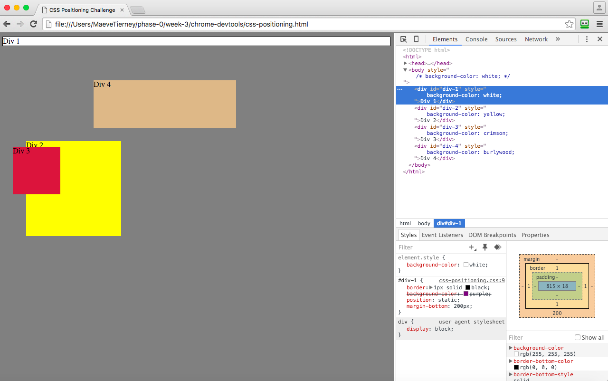

#1. 
#2. 
#3. 
#4. 
#5. 
#6. 
#7. 
#8. 
#9. 

#How can you use Chrome's DevTools inspector to help you format or position elements?
Chrome's DevTools inspector was brilliant at helping me format and position elements on the webpage. For example, the aspects width, height, position, display, color, background-color, padding and more were all aspects of the elements that we were able to play with to position and format elements. It took some getting used to, but after a while my partner and I figured things out quickly and increasingly each time. 

#How can you resize elements on the DOM using CSS?
On the Dom, properties inside each individual object may be tweaked and resized. Such elemnts are div, p, or h1, etc. You can manipulate these properties using CSS by playing with their attributes like we have been learning. You can change many things, some are, font-family, font-size, padding, borders, colors, background colors, margins, position, display and more. 

#What are the differences between absolute, fixed, static, and relative positioning? Which did you find easiest to use? Which was most difficult?
-Absolute positioning: sends the element to position itself in relation to the parent element that isn't static. If not specified, then it goes relative to html. 
-Static positioning: If you don't specify positioning this is the default. Basically where the element normally goes. 
-Relative: This positioning sends the elemnt relative to where it would be if it actually was static. 
-Fixed positioning: this sends the elemnt to anchor itself to the browser window, so when you scroll up and down the page it stays fixed on the screen and you can't escape it. 

For this challenge, the one we found absolute positioning the most useful because it was the only one that usually made the element not static and actually place itself somehwere on the page. The one that was the most difficult to work with was fixed, it was the most useless because we weren't scrolling up and down. 

#What are the differences between margin, border, and padding?
-Margin: This aspect of an element is the space around the element, adjusting this moves our elements closer or further apart from each other. 
-Border: This aspect is just the edge of the element, and is a property that doesn't affect the placement on the webpage.
-Padding: Also doesn't effect the placement of the element on the webpage. This aspect when adjusted creates or destroys space between the content of the element and the border. Adjusting this value creates or destroys space around the content. 

#What was your impression of this challenge overall? (love, hate, and why?)
I really do like CSS because it allows you to really nitpick at the design of your webpage, which I am interested in and enjoy. But I actually found this challenge very tedious and difficult at times. I do want to learn more though and become better at challenges like this. So it was a hate-love feeling! 